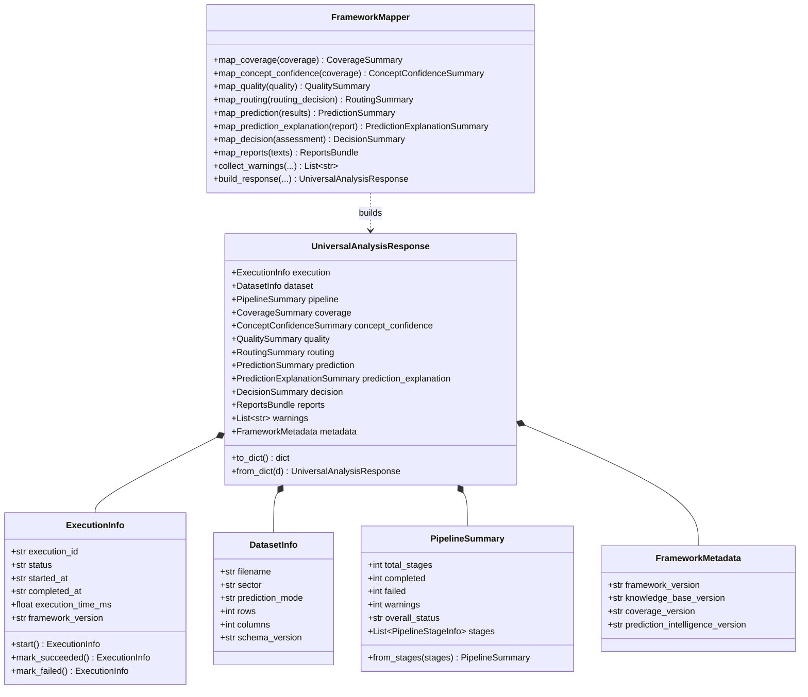
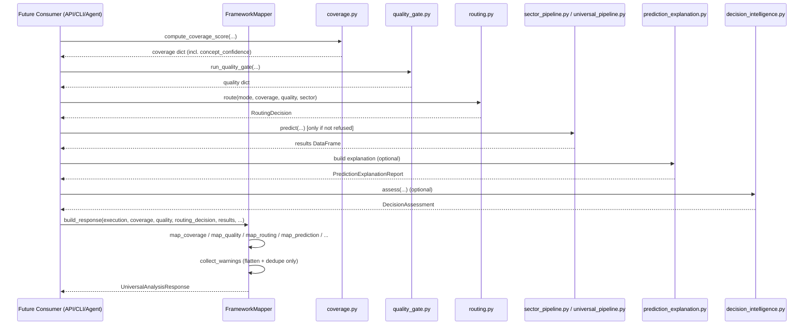

# Backend Integration Layer — Sprint 1

**Version 8.2 · Universal Churn Intelligence Framework (UCIF)**

## Purpose

The `backend/` package is an **adapter layer**, not part of the AI framework.
Its only job is to translate outputs that `universal_churn/` already
produces into one stable, versioned public contract —
`UniversalAnalysisResponse` — that every future consumer (REST API,
frontend, CLI, AI agents, SDKs, external integrations) can rely on
without needing to understand framework internals.

`universal_churn/` remains the single source of truth for every
computation: coverage scoring, concept confidence, the quality gate,
adaptive routing, prediction, prediction explanation, decision
intelligence, and prediction intelligence. This sprint changes **none**
of that behavior.

## Dependency direction

```
Frontend / API / SDK / Agent
          │
          ▼
       backend
          │
          ▼
  universal_churn  (Universal Churn Intelligence Framework)
```

`universal_churn/` never imports anything from `backend/`. This is
enforced by convention (no import of `backend` appears anywhere in
`universal_churn/`) and should be enforced by CI lint rule in a future
sprint.

## What was built this sprint

| Module | Responsibility |
|---|---|
| `backend/contracts/execution.py` | `ExecutionInfo` — run identity/timing |
| `backend/contracts/dataset.py` | `DatasetInfo` — what was analyzed |
| `backend/contracts/pipeline.py` | `PipelineStageInfo` / `PipelineSummary` — stage diagnostics |
| `backend/contracts/metadata.py` | `FrameworkMetadata` — version stamps |
| `backend/contracts/analysis_response.py` | `UniversalAnalysisResponse` and its remaining sections (`CoverageSummary`, `ConceptConfidenceSummary`, `QualitySummary`, `RoutingSummary`, `PredictionSummary`, `PredictionExplanationSummary`, `DecisionSummary`, `ReportsBundle`) |
| `backend/mappers/framework_mapper.py` | `FrameworkMapper` — framework output → contract, **mapping only** |
| `backend/exceptions/__init__.py` | `BackendError`, `MappingError`, `ContractValidationError`, `UnsupportedFrameworkOutputError` |
| `backend/utils/__init__.py` | Timestamp/ID helpers, recursive dataclass → dict serialization |

Explicitly **not** built this sprint (by design, per the sprint brief):
FastAPI, routers, services, middleware, authentication, a database,
file uploads, background workers, Docker, frontend integration.

## `FrameworkMapper` — the non-negotiable rule

`FrameworkMapper` performs:

- **NO business logic**
- **NO calculations**
- **NO validation**
- **NO routing**
- **NO reasoning**

It only reads fields off objects `universal_churn/` already produced
(`coverage.compute_coverage_score()`'s dict, `quality_gate.run_quality_gate()`'s
dict, a `routing.RoutingDecision`, a prediction `results` DataFrame, a
`prediction_explanation.PredictionExplanationReport`, a
`decision_intelligence.DecisionAssessment`) and reshapes them into the
public contract. Every `map_*` method accepts either a dict or a typed
object (via `backend.utils.safe_get`, which duck-types the read), so
callers never need to pre-adapt framework output.

Missing/None inputs map to `None` sections — never fabricated,
never defaulted to a "plausible-looking" value. A refused prediction
(quality gate FAIL, or `routing.ModelType.CRITICAL_UNRELIABLE`) still
produces a fully valid `UniversalAnalysisResponse`, just with
`prediction` / `prediction_explanation` / `decision` left as `None`.

## Architecture diagram

```mermaid
graph TD
    subgraph Consumers[Future Consumers - Sprint 2+]
        API[FastAPI]
        FE[Frontend]
        CLI[CLI]
        AGENT[AI Agents]
        SDK[SDKs]
    end

    subgraph Backend[backend/ - Sprint 1, this document]
        MAPPER[FrameworkMapper]
        CONTRACT[UniversalAnalysisResponse]
        EXC[Exceptions]
        UTIL[Utils]
    end

    subgraph Framework[universal_churn/ - unchanged]
        COV[coverage.py]
        CC[concept_confidence.py]
        QG[quality_gate.py]
        ROUTE[routing.py]
        SECTOR[sector_pipeline.py]
        UNIV[universal_pipeline.py]
        EXPL[prediction_explanation.py]
        DI[decision_intelligence.py]
        PIE[prediction_intelligence/]
    end

    API --> MAPPER
    FE --> MAPPER
    CLI --> MAPPER
    AGENT --> MAPPER
    SDK --> MAPPER

    MAPPER --> CONTRACT
    MAPPER --> EXC
    MAPPER --> UTIL

    MAPPER -.reads only.-> COV
    MAPPER -.reads only.-> CC
    MAPPER -.reads only.-> QG
    MAPPER -.reads only.-> ROUTE
    MAPPER -.reads only.-> SECTOR
    MAPPER -.reads only.-> UNIV
    MAPPER -.reads only.-> EXPL
    MAPPER -.reads only.-> DI
    MAPPER -.reads only.-> PIE
```



## Class diagram



## Sequence diagram — one analysis run



## Extension points

- **New framework signal** → add one field to the relevant contract
  section (additive, default `None`/empty) and one line in the
  matching `map_*` method. No existing consumer breaks.
- **New consumer** (FastAPI, mobile SDK, agent tool) → wraps
  `FrameworkMapper.build_response(...)`, serializes via
  `UniversalAnalysisResponse.to_dict()`. No new mapping code needed.
- **Pydantic adoption** (if request validation is needed later) → wrap
  these dataclasses with `pydantic.dataclasses` or `TypeAdapter`
  rather than rewriting them; the field shapes were chosen to be
  directly compatible.
- **Persisted / replayed responses** → `UniversalAnalysisResponse.from_dict()`
  reconstructs a full response from its own `to_dict()` output, so a
  response can be cached, logged as JSON, or replayed later.

## Sprint 2 plan (not built yet)

1. **FastAPI app** (`backend/api/`) exposing `POST /analyze` and
   `GET /analyze/{execution_id}`, both returning
   `UniversalAnalysisResponse.to_dict()` (or a thin Pydantic wrapper
   around it).
2. **Service layer** (`backend/services/`) that orchestrates the
   sequence in the diagram above — calling `universal_churn` in the
   right order, catching framework exceptions, and calling
   `FrameworkMapper.build_response(...)` exactly once per run. This is
   where retries/timeouts/async execution live, not in the mapper.
3. **Persistence** for `execution_id` lookups (in-memory first, a real
   database later) — out of scope until a consumer actually needs
   "check status of a running analysis."
4. **Auth middleware** and **file upload handling**, once a frontend
   or external integration is ready to consume this API.
5. **AI agent tool schema** — a thin JSON-schema description of
   `UniversalAnalysisResponse` for agent frameworks to consume
   directly, generated from these dataclasses rather than
   hand-maintained.

None of the above requires changing `backend/contracts` or
`backend/mappers` as built in this sprint — that is the point of
defining the contract first.
